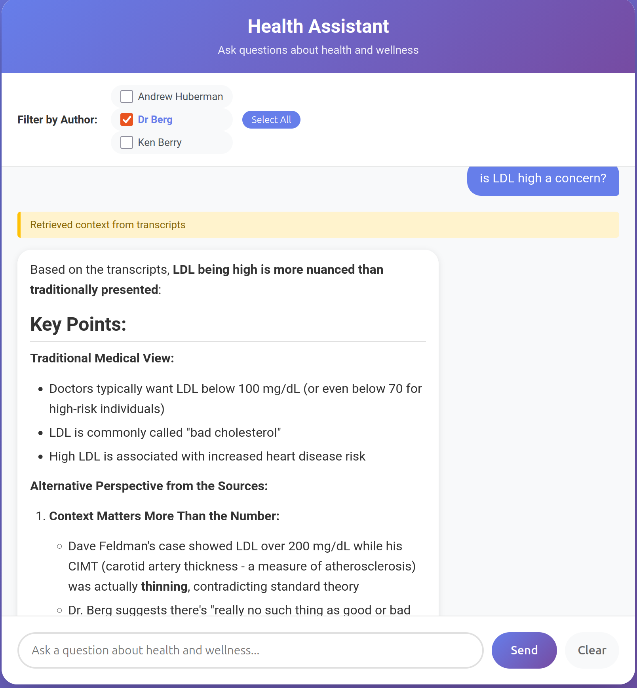

# Transcript RAG System

A Retrieval-Augmented Generation (RAG) system for querying podcast transcripts using Claude with automatic metadata extraction.

## Demo



## Project Structure

```
healthAI/
├── src/                          # Essential source code
│   ├── rag_system.py            # Core RAG system
│   ├── llm_client.py            # Unified LLM client (OpenAI/Anthropic)
│   ├── metadata_extractor.py   # Automatic metadata extraction
│   ├── rag_evaluator.py         # LLM-as-judge evaluation engine
│   ├── test_generator.py        # Auto-generate test datasets
│   ├── report_generator.py      # Generate markdown reports
│   ├── chat_rag.py              # RAG-enhanced chat
│   ├── web_chat.py              # Web interface
│   ├── smart_add_to_rag.py     # Smart RAG adder (auto metadata)
│   ├── add_folder_to_rag.py    # Manual RAG adder
│   └── templates/               # HTML templates for web interface
├── testing/                      # Testing and evaluation
│   ├── run_evaluation.py        # CLI for running evaluations
│   ├── test_datasets/           # Test question datasets (JSON)
│   ├── evaluation_results/      # Generated evaluation reports (markdown)
│   ├── example_folder_rag.py   # Usage examples
│   ├── demo_auto_metadata.py   # Metadata extraction demo
│   └── demo_reranking.py        # Cross-encoder reranking demo
├── data/                         # Transcript data (organize by author)
├── chroma_db/                    # Vector database storage (default varies by tool)
├── pyproject.toml               # Project configuration and dependencies (uv)
└── uv.lock                      # Locked dependencies (uv)
```

## Quick Start

1. **Install uv (if not already installed):**
   ```bash
   curl -LsSf https://astral.sh/uv/install.sh | sh
   ```

2. **Install dependencies:**
   ```bash
   uv sync
   ```

3. **Set your API key:**
   ```bash
   # For OpenAI (default)
   export OPENAI_API_KEY='your-openai-key-here'

   # Or for Anthropic Claude
   export ANTHROPIC_API_KEY='your-anthropic-key-here'
   export LLM_PROVIDER='anthropic'
   ```

4. **Add transcripts to RAG system:**
   ```bash
   # Add entire data directory with automatic metadata extraction
   uv run python src/smart_add_to_rag.py --data-dir
   ```

5. **Run the RAG-enhanced chatbot:**
   ```bash
   uv run python src/chat_rag.py
   ```

6. **Or run the web interface:**
   ```bash
   uv run python src/web_chat.py
   ```
   Then open http://localhost:5000 in your browser.

## Features

- **Multiple LLM Providers**: Supports both OpenAI (default) and Anthropic Claude
- **Cross-Encoder Reranking**: Improves retrieval accuracy using two-stage ranking (enabled by default)
- **Contextual Embeddings**: Adds metadata context to chunks before embedding for improved retrieval accuracy
- **Semantic Search**: Automatically finds relevant transcript excerpts for your questions
- **Automatic Metadata Extraction**: Extracts author, keywords, and topics from file organization
- **LLM-as-Judge Evaluation**: Comprehensive evaluation system with quality metrics and performance tracking
- **Local Embeddings**: Uses sentence-transformers (no external API needed for embeddings)
- **Persistent Storage**: Vector database saves to disk for fast subsequent runs
- **Multiple Authors**: Support for transcripts from multiple podcast hosts
- **Interactive Chat**: Natural conversation with AI, enhanced by transcript context
- **Web Interface**: Modern, responsive web UI with real-time streaming

## Core Files

### Source Code (`src/`)
- `chat_rag.py` - RAG-enhanced terminal chatbot (recommended)
- `web_chat.py` - Web-based chat interface
- `rag_system.py` - Core RAG functionality
- `llm_client.py` - Unified LLM client supporting OpenAI and Anthropic
- `rag_evaluator.py` - LLM-as-judge evaluation engine
- `test_generator.py` - Auto-generate test datasets
- `report_generator.py` - Generate markdown evaluation reports
- `smart_add_to_rag.py` - Add transcripts with automatic metadata extraction
- `add_folder_to_rag.py` - Add transcripts with manual metadata entry
- `metadata_extractor.py` - Automatic metadata extraction logic

### Testing & Evaluation (`testing/`)
- `run_evaluation.py` - CLI for running comprehensive evaluations
- `test_datasets/` - Test question datasets in JSON format
- `evaluation_results/` - Generated evaluation reports in markdown
- `example_folder_rag.py` - View collection statistics and usage examples
- `demo_auto_metadata.py` - Demonstrate metadata extraction
- `demo_reranking.py` - Demonstrate cross-encoder reranking features

## Example Usage

### Terminal Chat
```bash
$ uv run python src/chat_rag.py
Welcome to the AI Chatbot with RAG! (Using OPENAI: gpt-5-mini)
Loading RAG system from ./chroma_db_context...
RAG system ready!

You: What are the benefits of ketamine for depression?
[Retrieved context from transcripts]
AI: Based on the transcripts, ketamine has several notable benefits for treating depression:

1. **Rapid Relief**: Ketamine provides immediate relief from depressive symptoms...
[response continues with context from transcripts]
```

### Switching LLM Providers
```bash
# Use OpenAI (default)
uv run python src/chat_rag.py

# Use Anthropic Claude
export LLM_PROVIDER=anthropic
uv run python src/chat_rag.py
```

### Adding Transcripts
```bash
# Automatic metadata extraction (recommended)
# the data directory has folders for each author
$ uv run python src/smart_add_to_rag.py --data-dir #(default: ./data)

# Add specific folder, folder name is the author 
$ uv run python src/smart_add_to_rag.py --folder data/andrew_huberman

# Add single file
$ uv run python src/smart_add_to_rag.py --file data/andrew_huberman/ketamine_depression.txt
 
```

## Evaluation & Testing

The system includes a comprehensive evaluation framework using **LLM-as-Judge** methodology to assess RAG performance.

### Quick Evaluation

Run a quick evaluation on sample questions:
```bash
uv run python testing/run_evaluation.py --num-questions 5
```

View the generated report in `testing/evaluation_results/`.

### Features

- **Dual Metrics**: Evaluates both retrieval quality and response quality separately
- **LLM-as-Judge**: Uses structured prompts for consistent, nuanced evaluation
- **Hallucination Detection**: Identifies unsupported claims in responses
- **Performance Tracking**: Measures query speed (retrieval time, response time)
- **Comprehensive Reports**: Human-readable markdown with metrics, explanations, and recommendations

### Evaluation Metrics

**Retrieval Quality:**
- Relevance Score (0-5 scale)
- Precision@K
- Mean Reciprocal Rank (MRR)
- Recall (if expected sources provided)

**Response Quality:**
- Accuracy: Correctness of the answer
- Completeness: Coverage of important aspects
- Faithfulness: Grounding in retrieved context (hallucination detection)
- Relevance: Directly addresses the question

**Performance:**
- Retrieval time (vector search)
- Response generation time (LLM)
- Total query time

### Generate Test Dataset

Auto-generate diverse test questions from your transcripts:

```bash
# Generate 100 test questions
uv run python src/test_generator.py --output testing/test_datasets/my_tests.json --num-questions 100
```

This creates questions across 5 categories:
- **Specific author queries** (30%): "What does [Author] say about...?"
- **Topic-based queries** (25%): "How to improve sleep quality?"
- **Multi-hop queries** (20%): "Compare different approaches to..."
- **Fact-based queries** (15%): "What are the benefits of...?"
- **Comparison queries** (10%): "How do experts differ on...?"

### Run Evaluation

**Full evaluation:**
```bash
uv run python testing/run_evaluation.py
```

**Custom options:**
```bash
# Evaluate with custom dataset
uv run python testing/run_evaluation.py --dataset testing/test_datasets/my_tests.json

# Limit number of questions (faster testing)
uv run python testing/run_evaluation.py --num-questions 10

# Filter by specific author
uv run python testing/run_evaluation.py --author-filter "Andrew Huberman"

# Use different ChromaDB database
uv run python testing/run_evaluation.py --chroma-db ./custom_chroma_db

# Verbose progress
uv run python testing/run_evaluation.py --verbose
```

### Interpret Results

The evaluation generates a markdown report with:

1. **Executive Summary**: Overall scores, hallucination rate, key findings
2. **Retrieval Performance**: Relevance scores, precision, performance by query type
3. **Response Quality**: Accuracy, completeness, faithfulness, relevance
4. **Query Speed Performance**: Average/min/max times for retrieval and response generation
5. **Top/Worst Cases**: Best and worst performing test cases
6. **Detailed Breakdown**: Per-question analysis with judge explanations
7. **Recommendations**: Actionable suggestions for improvement

**Example output:**
```markdown
## Executive Summary
Total Test Cases: 100

| Metric | Score |
|--------|-------|
| Retrieval Quality | 4.2/5.0 |
| Response Quality | 4.5/5.0 |
| Hallucination Rate | 2.3% |
| Precision@3 | 0.87 |

## Query Speed Performance
| Metric | Avg (ms) | Min (ms) | Max (ms) |
|--------|----------|----------|----------|
| Retrieval Time | 106 | 8 | 301 |
| Response Generation | 8411 | 7590 | 9119 |
| Total Time | 26811 | 23799 | 28944 |
```

### Evaluation Files

- `src/rag_evaluator.py` - Core evaluation engine with LLM-as-judge
- `src/test_generator.py` - Auto-generates test datasets
- `src/report_generator.py` - Creates markdown reports
- `testing/run_evaluation.py` - CLI for running evaluations
- `testing/test_datasets/` - Test question datasets
- `testing/evaluation_results/` - Generated evaluation reports

## Reranking

The RAG system uses **two-stage retrieval** for improved accuracy:

### How It Works

1. **Stage 1 - Semantic Search**: Fast bi-encoder retrieves 20+ candidate chunks using embeddings
2. **Stage 2 - Reranking**: Cross-encoder model (`cross-encoder/ms-marco-MiniLM-L6-v2`) precisely scores each candidate
3. **Final Results**: Top N chunks returned, sorted by cross-encoder relevance scores

### Benefits

- **Better Accuracy**: Cross-encoders are more accurate than bi-encoders for ranking
- **Nuanced Understanding**: Captures query-document interactions better
- **Improved Context**: Higher quality chunks lead to better LLM responses

### Usage

Reranking is **enabled by default**. To disable it:

```bash
# Terminal chat without reranking
uv run python src/chat_rag.py --no-reranking

# Web interface without reranking
uv run python src/web_chat.py --no-reranking
```

### Demo

See reranking in action:
```bash
uv run python testing/demo_reranking.py
```

This demonstrates:
- Relevance scores with reranking
- Comparison: with vs without reranking
- Author filtering + reranking
- Context with relevance scores

## Architecture

The RAG system uses:
- **OpenAI gpt-5-mini** (default) or **Anthropic Claude Sonnet 4.5** for chat responses
- **ChromaDB** for vector storage
- **sentence-transformers** (`all-MiniLM-L6-v2`) for bi-encoder embeddings
- **cross-encoder** (`ms-marco-MiniLM-L6-v2`) for reranking
- **~300 word chunks** with 30 word overlap for optimal context retrieval
- **Flask** for the web interface
 
See `CLAUDE.md` for detailed architecture documentation.
